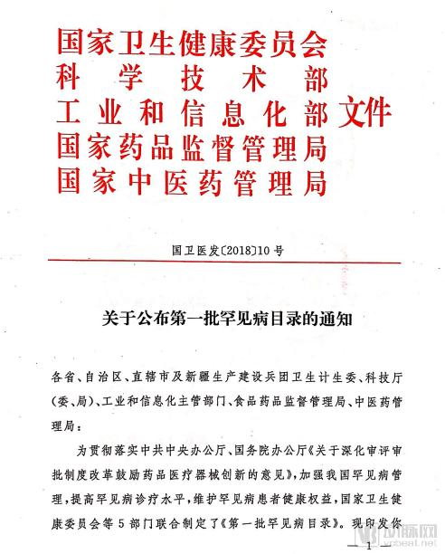
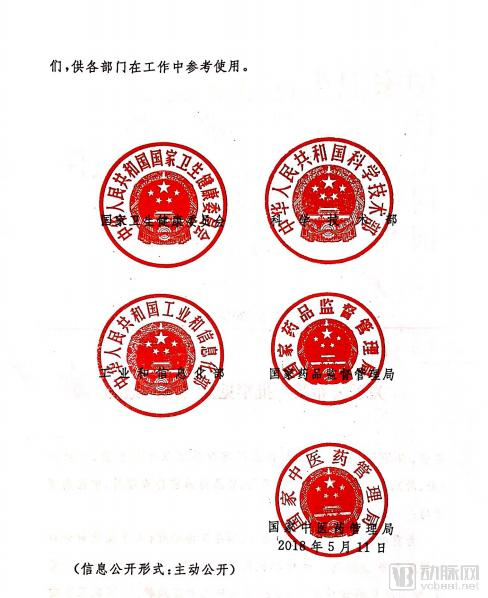
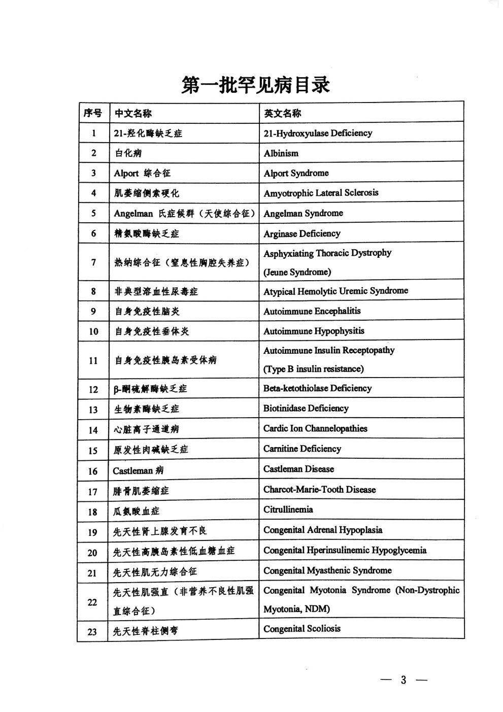
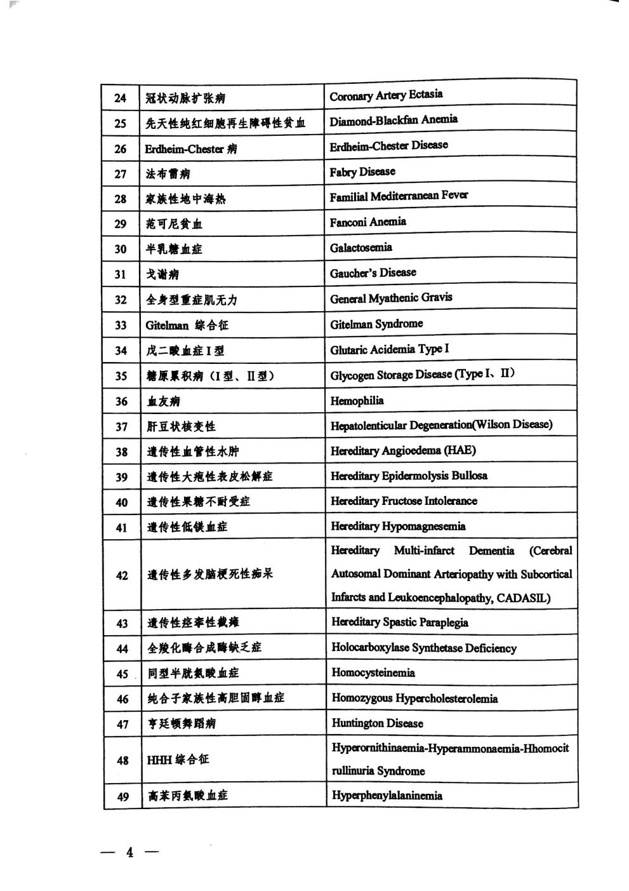
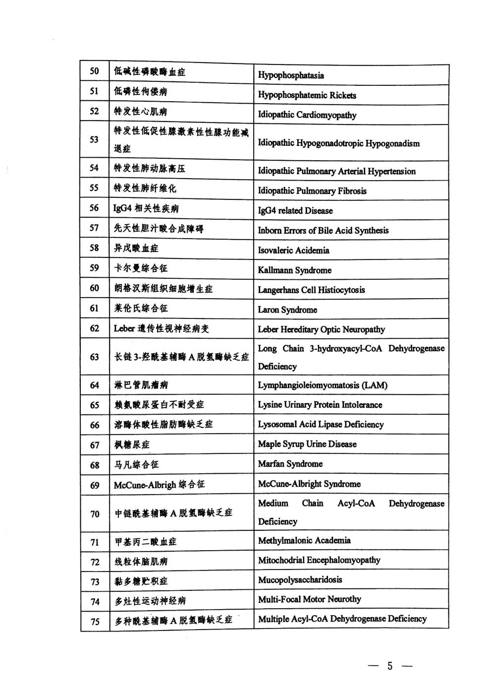
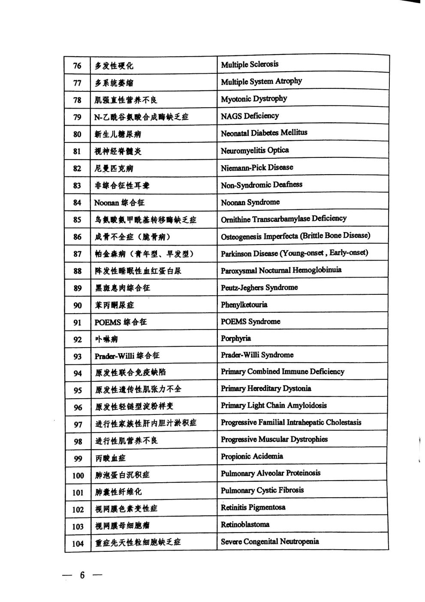
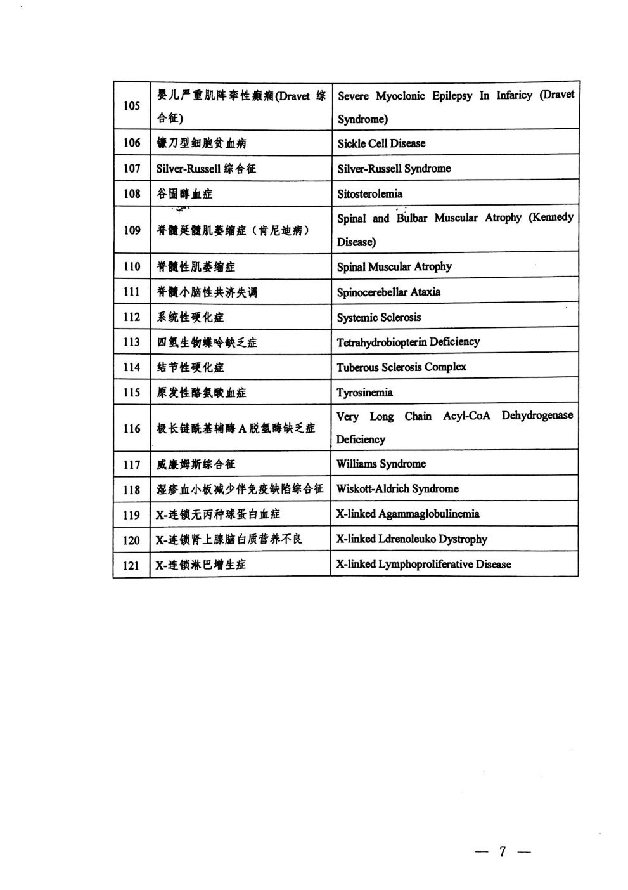

国家版罕见病名录共121种，终于落定。国家卫生健康委员会、科学技术部、工业和信息化部、国家药品监督管理局、国家中医药管理局等5部门联合发布。

罕见病是指那些发病率很低的一类疾病，这些疾病往往是严重的、慢性的、遗传性的且常常危及生命。

罕见病是人类医学面临的最大挑战之一，目前已知的近7000种罕见病，我国有超过1000万罕见病患者，但仅有不足40%的患者得到确诊，且确诊平均需要5年。

目前，普遍存在科研投入少、诊断率低、缺乏有效治疗手段且药物往往不在医保体系中现象，包括中国在内的绝大多数国家的患者，面临"病无所医"、"医无所药"、 "药无所保"的窘境。

在过去的30年，欧美等国家和地区已经探索出了一条积极有效的道路，在各利益相关方的共同努力下，在罕见病的研究、诊断、治疗、药物研发及市场准入、医疗保障等方面都取得了很大发展，纵观这些国家和地区的经验，最关键的举措就是"以患者为中心"设计出一套具有创新激励的制度体系。

在美国，1983年颁布《孤儿药法案》（ODA），截至2015年，美国食品药品监督管理局（FDA）授予3647个孤儿药资格认定，批准上市了554个孤儿药，为277种罕见病带来诊疗新希望。

虽然中国在罕见病领域和欧美等国家和地区仍有较大差距，但近些年的发展速度迅猛，在各相关方的努力下，公众意识得到了有效提升，罕见病诊疗水平不断提高、各地积极探索罕见病医保路径及患者组织纷纷呼吁呐喊，正朝着积极、有效的方向去整体解决罕见病的问题。

此前，我国还没有官方的罕见病定义，如何提高罕见病诊断率、降低患者成本是罕见病患者目前面临的问题。此次国家版名录的发布是在整个行业多方努力的结果，给罕见病患者家庭及罕见病与孤儿药行业带来新的希望。
# 附录

